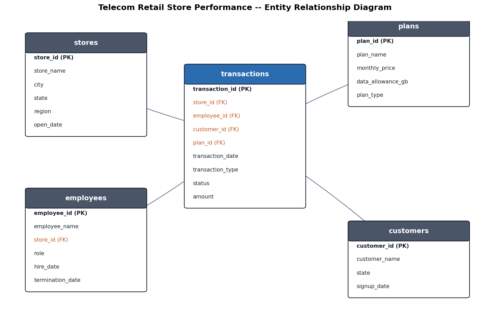

# Telecom Retail Store Performance Analysis (SQL)

## Project Overview
This intermediate-level SQL project analyzes a multi-table retail database modeled on a prepaid wireless retail chain (in the style of a Cricket Wireless authorized retailer) with stores across several U.S. states. It covers store and regional performance, employee (sales rep) performance, plan popularity, and customer value — the same kind of monthly account and performance reporting a retail data analyst produces for management review.

The project demonstrates an intermediate SQL skill set: multi-table joins, common table expressions (CTEs), window functions (`RANK`, `DENSE_RANK`, `ROW_NUMBER`, `LAG`, running totals), subqueries, `CASE` logic, views, and data-quality checks (duplicate detection, `NULL` handling) — run end-to-end against a live MySQL 8.0 database.

## Business Questions
- Which stores and regions generate the most revenue, and which are underperforming relative to their region?
- How is revenue trending month over month, and what's each store's cumulative progress?
- Who are the top-performing sales reps, company-wide and within their own store?
- Are any currently-employed reps going quiet (no completed sales recently)?
- Which prepaid plans drive the most revenue?
- How does customer value break down across the base (high/medium/low spenders)?
- Where are the data-quality gaps (duplicate transactions, missing customer state) that would distort these numbers if left uncleaned?

## Tools & Technologies
- MySQL 8.0
- MySQL Workbench (or the `mysql` CLI)
- Python (data generation and ERD diagram only — all analysis is pure SQL)

## Dataset
The database contains:
- 18 stores across 7 states (PA, NY, MD, VA, OH, WV, MI) grouped into 3 regions
- 50 employees (sales reps, assistant managers, store managers)
- 2,600 customers
- 6 prepaid plans
- 10,540 transactions (Jan 2025–Jun 2026) spanning new activations, upgrades, plan changes, accessory sales, and recurring bill payments

The data intentionally includes realistic messiness: 40 duplicate transactions (simulating a point-of-sale double-submit), self-service transactions with no employee attached, accessory-only sales with no plan attached, and ~3% of customers missing a state — so the project demonstrates real data-cleaning work, not just querying a pre-cleaned table.

## Entity Relationship Diagram


`transactions` is the fact table at the center, joining out to `stores`, `employees`, `customers`, and `plans`.

## Analysis Workflow
1. Design the schema (`sql/01_schema.sql`) with primary/foreign key constraints
2. Load the data (`sql/02_load_data.sql`) and handle blank CSV fields as `NULL`
3. Detect and quantify data-quality issues: duplicate transactions, missing values
4. Build a reusable cleaned view (`v_transactions_clean`) that de-duplicates and excludes non-completed transactions
5. Analyze store and regional performance, including rank-within-region and month-over-month trends
6. Analyze employee performance and flag reps with no recent sales
7. Analyze plan popularity and customer value tiers
8. Translate findings into the kind of monthly performance summary a retail district manager would actually use

## Key Skills Demonstrated
- Multi-table joins (INNER, across 4–5 tables at once)
- Common table expressions (CTEs)
- Window functions: `RANK`, `DENSE_RANK`, `ROW_NUMBER`, `LAG`, running totals with `SUM() OVER`
- Subqueries and `NOT EXISTS`
- `CASE` logic for segmentation
- Views for reusable, analyst-friendly reporting
- Data cleaning: duplicate detection (`GROUP BY … HAVING COUNT(*) > 1`), `NULL` handling with `NULLIF`
- Aggregate functions with `GROUP BY` / `HAVING`
- Date bucketing (`DATE_FORMAT`) for monthly trend analysis

## Running This Project
1. Make sure you have MySQL 8.0+ running (locally, or via MySQL Workbench connected to a server).
2. From the project root, run the schema script:
   ```bash
   mysql -u root -p < sql/01_schema.sql
   ```
3. Load the data. `LOAD DATA LOCAL INFILE` requires local-infile enabled on both the client and server:
   ```bash
   mysql -u root -p -e "SET GLOBAL local_infile = 1;"
   mysql --local-infile=1 -u root -p telecom_retail < sql/02_load_data.sql
   ```
   (Run this from the project root so the relative `data/*.csv` paths resolve. If you'd rather not enable local-infile, MySQL Workbench's **Table Data Import Wizard** can load each CSV into its matching table instead.)
4. Run the analysis queries:
   ```bash
   mysql -u root -p telecom_retail < sql/03_analysis_queries.sql
   ```
   Or open `sql/03_analysis_queries.sql` in MySQL Workbench and run each numbered query individually to inspect the results.

## Repository Structure
```text
telecom-retail-store-performance-sql/
├── data/
│   ├── plans.csv
│   ├── stores.csv
│   ├── employees.csv
│   ├── customers.csv
│   └── transactions.csv
├── sql/
│   ├── 01_schema.sql
│   ├── 02_load_data.sql
│   └── 03_analysis_queries.sql
├── images/
│   └── erd.png
├── README.md
└── .gitignore
```

## Business Deliverable
The queries in this project are written the way a district manager or regional director would actually ask for them — a store leaderboard, which stores lag their region, which reps need a check-in, and where revenue is concentrated by plan — rather than as abstract SQL syntax exercises. Each query is commented with the business question it answers, and the data-cleaning section explains why those checks matter before trusting the numbers above them.

## Author
Mirjalil Mirfozilov
